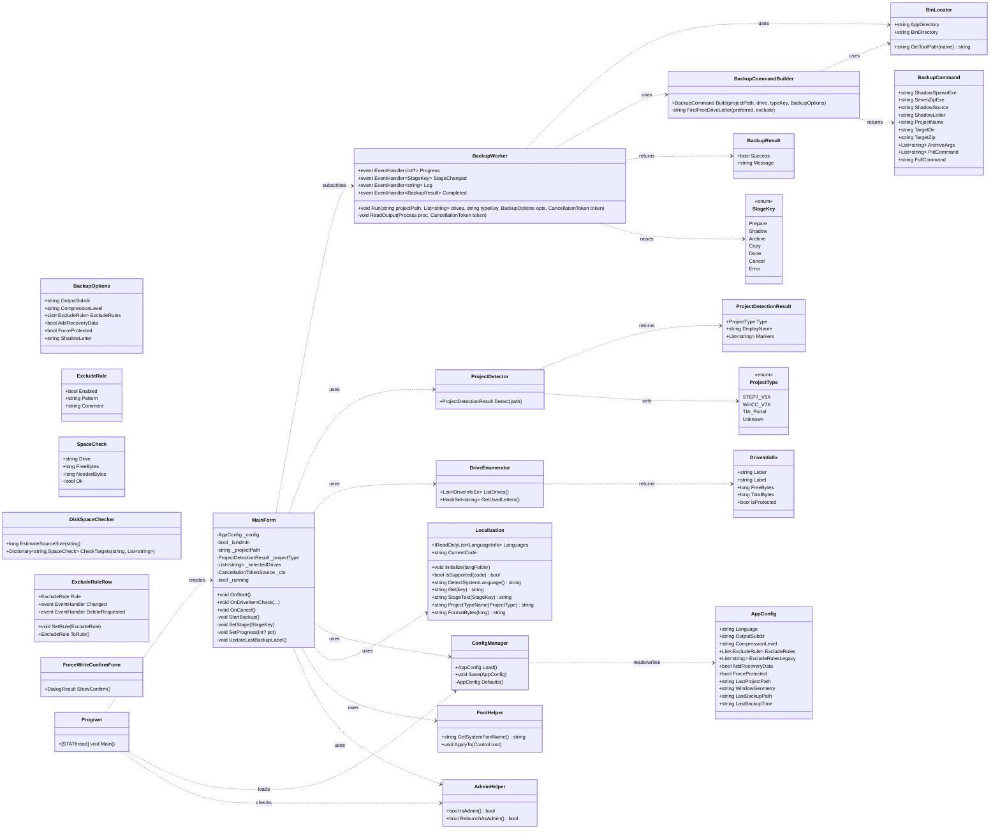
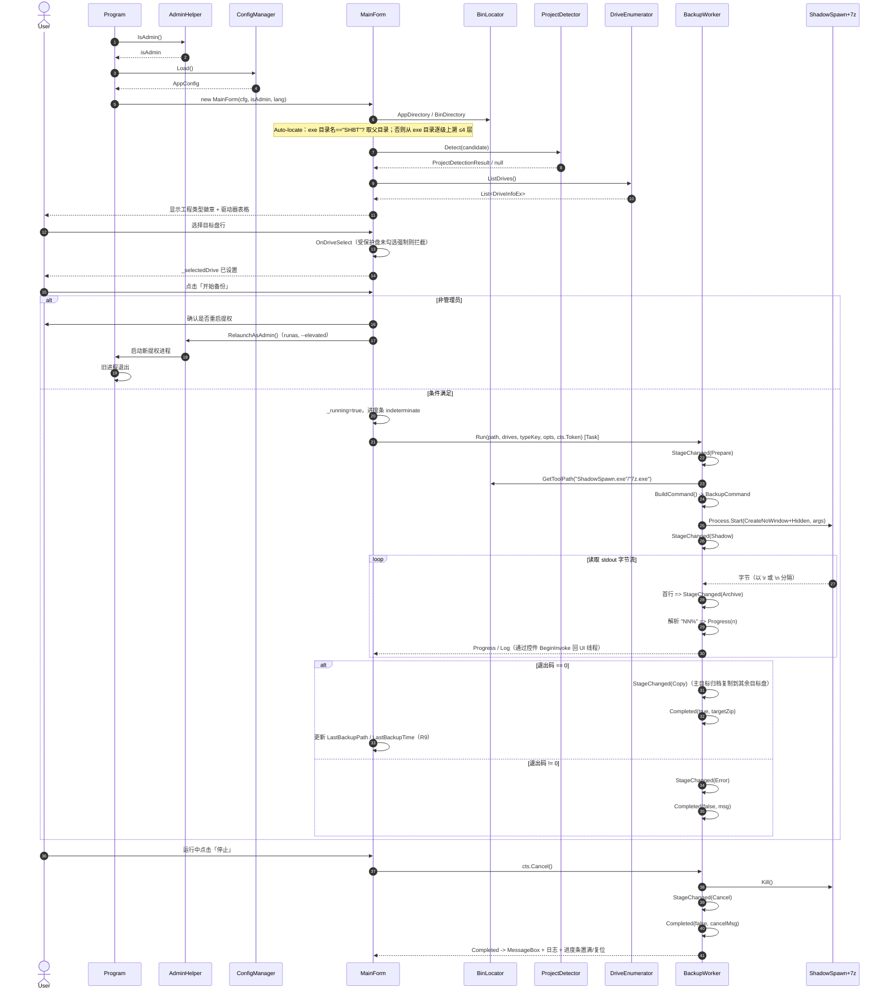

# SHBT · .NET Framework 4.8 WinForms 架构设计文档

> 作者：高见远（Software Architect） · 项目：SHBT
> 目标：将现有 Python + tkinter 的「西门子工程热备份」GUI 完整重写为 **C# / .NET Framework 4.8 / WinForms** 应用。
> 配套图：`docs/class-diagram.mermaid`（类图）、`docs/sequence-diagram.mermaid`（时序图）。

---

## 1. 实现方案与框架选型理由

### 1.1 核心技术决策（已由主理人拍板，此处仅记录理由）

| 项 | 决策 | 理由 |
|----|------|------|
| 目标框架 | **.NET Framework 4.8** | Win10/11 出厂即内置 4.8 运行时，**无需安装、无需打包运行时**；`dotnet 10 SDK` 在本机已验证可交叉编译 net48（`Microsoft.NETFramework.ReferenceAssemblies` 提供引用程序集）。 |
| UI 技术 | **WinForms**（`System.Windows.Forms`） | 相比 WPF，WinForms 体积最小、原生、无额外依赖；本工具是「单一窗口 + 几个控件」的工具型程序，WinForms 完全胜任且最稳。 |
| 发布方式 | **framework-dependent（非 self-contained）** | 不打包运行时 → 生成的 `SHBT.exe` 仅约 **5 KB**，最终交付物 = `SHBT.exe` + `bin\`（7z.exe / 7z.dll / ShadowSpawn.exe）≈ **3 MB**，拷贝即用、零安装。 |
| 配置文件 | `app.manifest`（`requireAdministrator` + dpi/longPath 感知） | VSS 卷影副本必须管理员权限；manifest 让系统启动时即提权，子进程（ShadowSpawn/7z）继承提权令牌，避免黑框。 |
| 配置文件读写 | 内置 `System.Runtime.Serialization.Json.DataContractJsonSerializer` | **零运行时 NuGet 依赖**（框架自带），保存语言/压缩级别/排除规则等到 `config.json`。 |
| 原生工具 | 沿用既有 `bin\` 三件套 | 7z 负责打包、ShadowSpawn 负责 VSS 卷影挂载；二者均为控制台程序，通过 `Process` 启动并隐藏窗口。 |

### 1.2 交付物布局（最终目录）

```
SHBT\                          ← 工程根目录（由 csproj 生成，即发布文件夹）
├─ SHBT.exe                    ← ~5 KB，framework-dependent
└─ bin\
   ├─ 7z.exe        (468,992 B)
   ├─ 7z.dll        (1,679,360 B)
   └─ ShadowSpawn.exe (82,944 B)
```
合计 ≈ 3 MB，拷贝到任意 Win10/11 即可运行（前提是系统已启用 .NET 4.8，见第 8 节风险）。

### 1.3 架构模式

- **MVC 轻量变体**：`Core/*` 为模型与业务逻辑（无 UI 依赖），`Ui/*` 为视图与交互，`Program.cs` 为入口装配。
- **事件驱动进度**：`BackupWorker` 通过 `event`（Progress / StageChanged / Log / Completed）向 UI 上报，UI 用 `ISynchronizeInvoke.BeginInvoke`（WinForms 控件的 `Invoke`/`BeginInvoke`）切回 UI 线程，等价于 Python 的 `root.after(0, ...)`。
- **后台执行**：备份在 `Task` / 专线程中运行，主线程不被阻塞，进度条仍可动。

---

## 2. 文件清单与相对路径

根目录：`E:\WorkBuddy\SHBT\SHBT\`

```
SHBT\
├─ SHBT.csproj                     # SDK 风格项目文件（net48 + WinForms + 引用程序集 + bin 拷贝）
├─ app.manifest                     # 提权 + DPI + longPath 感知
├─ Program.cs                       # 入口：管理员检测、加载配置、启动 MainForm
├─ Properties\
│  └─ AssemblyInfo.cs               # 程序集元信息（版本/标题）
├─ Core\
│  ├─ ProjectType.cs                # ProjectType 枚举 + 类型元数据（特征目录、显示名）
│  ├─ ProjectDetector.cs            # 工程类型识别（AMOBJS/GRACS/XRef）
│  ├─ DriveEnumerator.cs            # 逻辑驱动器枚举（P/Invoke）+ DriveInfoEx 模型
│  ├─ ConfigManager.cs              # AppConfig 模型 + 配置加载/保存（DataContractJsonSerializer，V2 排除规则迁移 + LastBackup）
│  ├─ ExcludeRule.cs                # 排除规则模型（Enabled/Pattern/Comment）
│  ├─ BackupOptions.cs              # 单次备份选项模型（List<ExcludeRule> / AddRecoveryData / ForceProtected）
│  ├─ DiskSpaceChecker.cs           # 源目录大小估算 + 逐目标盘空间预检（R8）
│  ├─ BackupCommandBuilder.cs       # 构造 ShadowSpawn+7z 命令（含空闲盘符查找）
│  ├─ BackupWorker.cs               # 备份执行引擎（进程启动、字节流解析、取消、阶段事件）
│  ├─ BinLocator.cs                 # 解析 exe 目录 / bin 目录 / 工具路径
│  └─ AdminHelper.cs                # IsAdmin() + RelaunchAsAdmin()（runas + --elevated 守卫）
├─ Ui\
│  ├─ Localization.cs               # 运行时扫描 lang/*.json 资源（独立于 exe）+ 阶段文案 + 工程类型名 + 字节格式化
│  ├─ FontHelper.cs                 # 读取系统 UI 字体 + 递归应用到所有控件
│  ├─ MainForm.cs                   # 主窗口逻辑与交互装配（多目标盘 / 排除规则行 / 强制写入确认 / 最近备份）
│  ├─ ExcludeRuleRow.cs             # 单条排除规则行控件（Enabled/Pattern/Comment）
│  ├─ ForceWriteConfirmForm.cs      # 强制写入受保护盘二次确认对话框（R10）
│  ├─ MainForm.Designer.cs         # InitializeComponent（可手写，无需 VS 设计器）
│  └─ MainForm.resx                 # 资源（可为空，字符串统一走 Localization）
├─ bin\                             # ← 交付时由 T05 从 native\ 拷贝原生工具
│  ├─ 7z.exe
│  ├─ 7z.dll
│  └─ ShadowSpawn.exe
└─ docs\
   ├─ ARCHITECTURE.md               # 本文件
   ├─ class-diagram.mermaid
   └─ sequence-diagram.mermaid
```

### 2.1 `SHBT.csproj` 要点

```xml
<Project Sdk="Microsoft.NET.Sdk">
  <PropertyGroup>
    <OutputType>WinExe</OutputType>            <!-- 无控制台窗口 -->
    <TargetFramework>net48</TargetFramework>
    <UseWindowsForms>true</UseWindowsForms>    <!-- WinForms SDK 风格开关 -->
    <AssemblyName>SHBT</AssemblyName>
    <RootNamespace>OneTool</RootNamespace>
    <ApplicationManifest>app.manifest</ApplicationManifest>
    <LangVersion>latest</LangVersion>
    <Nullable>disable</Nullable>
  </PropertyGroup>

  <ItemGroup>
    <!-- 仅构建期依赖：让 .NET 10 SDK 能编译 net48 -->
    <PackageReference Include="Microsoft.NETFramework.ReferenceAssemblies" Version="1.0.3" />
  </ItemGroup>

  <ItemGroup>
    <!-- 把原生工具带进发布文件夹 -->
    <Content Include="bin\**\*">
      <CopyToOutputDirectory>PreserveNewest</CopyToOutputDirectory>
    </Content>
  </ItemGroup>
</Project>
```

### 2.2 `app.manifest` 要点

```xml
<?xml version="1.0" encoding="utf-8"?>
<assembly manifestVersion="1.0" xmlns="urn:schemas-microsoft-com:asm.v1">
  <assemblyIdentity version="1.0.0.0" name="SHBT"/>
  <trustInfo xmlns="urn:schemas-microsoft-com:asm.v2">
    <security>
      <requestedPrivileges xmlns="urn:schemas-microsoft-com:asm.v3">
        <requestedExecutionLevel level="requireAdministrator" uiAccess="false" />
      </requestedPrivileges>
    </security>
  </trustInfo>
  <compatibility xmlns="urn:schemas-microsoft-com:compatibility.v1">
    <application>
      <supportedOS Id="{8e0f7a12-bfb3-4fe8-b9a5-48fd50a15a9a}" /> <!-- Win10/11 -->
    </application>
  </compatibility>
  <application xmlns="urn:schemas-microsoft-com:asm.v3">
    <windowsSettings>
      <dpiAware xmlns="http://schemas.microsoft.com/SMI/2005/WindowsSettings">true/pm</dpiAware>
      <dpiAwareness xmlns="http://schemas.microsoft.com/SMI/2016/WindowsSettings">PerMonitorV2, PerMonitor</dpiAwareness>
      <longPathAware xmlns="http://schemas.microsoft.com/SMI/2016/WindowsSettings">true</longPathAware>
    </windowsSettings>
  </application>
</assembly>
```

> 注：带上 `requireAdministrator` 后，进程**启动即提权**，`IsAdmin()` 恒为 true，运行时 `RelaunchAsAdmin` 分支作为防御性兜底保留（例如 manifest 被剥离或特殊启动路径）。若主理人后续想改为「默认不提权、点击时再 runas」，只需把 `level` 改为 `asInvoker` 并启用 `AdminHelper.RelaunchAsAdmin`（见第 8 节开放问题）。

---

## 3. 数据结构与接口（类图）

> 完整可渲染版见 `docs/class-diagram.mermaid`。



---

## 4. 调用流程（时序图）

> 完整可渲染版见 `docs/sequence-diagram.mermaid`。



**关键对象初始化顺序**：`Program.Main` → `AdminHelper.IsAdmin()` → `ConfigManager.Load()` → `new MainForm(cfg, isAdmin, lang)`（构造内 `BinLocator` 解析路径、`FontHelper` 应用字体、`Localization` 应用文案、`AutoLocate` 自动定位、`DriveEnumerator.ListDrives` 刷新表格）→ `Application.Run(form)`。

---

## 5. 任务拆分（按依赖排序，分模块）

> 硬性约束：≤ 5 个任务、每任务 ≥ 3 文件、首任务为「项目基础设施」、尽量仅依赖 T01。
> 与「Pass 1~5」一一对应。

| 任务 | 名称 | 来源文件（创建/修改） | 依赖 | 优先级 |
|------|------|----------------------|------|--------|
| **T01** | 项目基础设施与公共模块 | `SHBT.csproj`、`app.manifest`、`Program.cs`、`Properties/AssemblyInfo.cs`、`Core/BinLocator.cs`、`Ui/Localization.cs`、`Ui/FontHelper.cs` | — | P0 |
| **T02** | 工程检测与驱动器枚举 | `Core/ProjectType.cs`、`Core/ProjectDetector.cs`、`Core/DriveEnumerator.cs`、`Core/ConfigManager.cs` | T01 | P0 |
| **T03** | 备份执行引擎 | `Core/BackupOptions.cs`、`Core/BackupCommandBuilder.cs`、`Core/BackupWorker.cs` | T01, T02 | P0 |
| **T04** | 主窗体 UI 与交互装配 | `Ui/MainForm.cs`、`Ui/MainForm.Designer.cs`、`Ui/MainForm.resx`、`Core/AdminHelper.cs` | T01, T02, T03 | P1 |
| **T05** | 构建、资源拷贝与冒烟测试 | `bin/7z.exe`、`bin/7z.dll`、`bin/ShadowSpawn.exe`、`docs/ARCHITECTURE.md` | T01–T04 | P1 |

### 各任务职责说明

**T01 · 项目基础设施与公共模块（Pass 1）**
- `SHBT.csproj`：net48 + `UseWindowsForms` + `Microsoft.NETFramework.ReferenceAssemblies` + `bin\**` 内容拷贝 + 关联 `app.manifest`。
- `app.manifest`：`requireAdministrator` + `dpiAware`/`dpiAwareness` + `longPathAware` + `supportedOS`。
- `Program.cs`：`[STAThread] Main()` → `SetProcessDpiAwareness` P/Invoke（兜底）→ `AdminHelper.IsAdmin()` → `ConfigManager.Load()` → `Application.EnableVisualStyles()` → `new MainForm(...)` → `Application.Run`。
- `Properties/AssemblyInfo.cs`：程序集标题/版本（与 i18n 的 version 文案保持一致）。
- `Core/BinLocator.cs`：`AppDirectory = Path.GetDirectoryName(Application.ExecutablePath)`；`BinDirectory = Path.Combine(AppDirectory, "bin")`；`GetToolPath(name) = Path.Combine(BinDirectory, name)`。对应 Python `resource_path`/`get_bin_tool`（.NET 无 `_MEIPASS`，工具恒在 `<exedir>\bin\`）。
- `Ui/Localization.cs`：运行时扫描 `lang/*.json` 资源文件（独立于 exe），构建语言表；`Initialize(langFolder)`、`Languages`、`CurrentCode`、`IsSupported`、`DetectSystemLanguage`、`Get(key)`、`StageText(StageKey)`、`ProjectTypeName(ProjectType)`、`FormatBytes(long)`；en-US 嵌入式兜底，平铺 JSON 用内置轻量解析器（不依赖 NuGet）。
- `Ui/FontHelper.cs`：P/Invoke `SystemParametersInfo(SPI_GETNONCLIENTMETRICS, ...)` 读取 `lfMessageFont.lfFaceName`，失败回退 `"Microsoft YaHei"`；`ApplyTo(Control root)` 递归遍历 `Controls` 设置 `Font`（解决中文→日文字形回退）。

**T02 · 工程检测与驱动器枚举（Pass 2）**
- `Core/ProjectType.cs`：`enum ProjectType { STEP7_V5X, WinCC_V7X, TIA_Portal, Unknown }`；附静态映射：特征目录（`AMOBJS`/`GRACS`/`XRef`）与显示名。对应 `detector.PROJECT_TYPES`。
- `Core/ProjectDetector.cs`：`Detect(string path) → ProjectDetectionResult`（含 `Type/DisplayName/Markers`）。判定顺序 `AMOBJS→GRACS→XRef`，**后匹配覆盖先匹配**（与 `detector.py` 一致）。
- `Core/DriveEnumerator.cs`：P/Invoke `GetLogicalDriveStringsW` + `GetDriveType`（排除非固定盘/源盘）、`GetVolumeInformationW`（卷标）、`GetDiskFreeSpaceExW`（剩余/总空间）；返回 `List<DriveInfoEx>`；`IsProtected = label 含 "AX NF ZZ"/"AXNFZZ"/"LICENSE"（不区分大小写）`；`GetUsedLetters()`。完全对应 `drives.py`。
- `Core/ConfigManager.cs`：`[DataContract] class AppConfig`（Language/OutputSubdir/CompressionLevel/ExcludeRules[List<ExcludeRule>]/ExcludeRulesLegacy[兼容旧字符串数组]/AddRecoveryData/ForceProtected/LastProjectPath/WindowGeometry/LastBackupPath/LastBackupTime）；`Load()` 合并默认值、`Save()`；排除规则清洗去重（`normalize_excludes`）；旧版 `exclude_rules` 字符串数组自动迁移为 V2 `ExcludeRule` 列表。使用 `DataContractJsonSerializer`（框架自带，零 NuGet 依赖）。R2/R3/R9。

**T03 · 备份执行引擎（Pass 3）**
- `Core/BackupOptions.cs`：`OutputSubdir`(默认 "Backups")、`CompressionLevel`("store/fast/standard/max"→`-mx0/-mx1/-mx5/-mx9`)、`ExcludeRules`(R2：`List<ExcludeRule>`，仅启用项生成 `-xr!`，禁用项忽略)、`AddRecoveryData`(R3：默认关；恢复记录 `-rr` 因 7-Zip 19.00 不支持且 `.zip` 格式不支持而暂未实现，命令不追加 `-rr*`，UI 复选框已禁用)、`ForceProtected`、`ShadowLetter`(默认 "Q")。
- `Core/BackupCommandBuilder.cs`：`Build(projectPath, drive, typeKey, opts) → BackupCommand`，**精确还原** `backup.build_archive_command`：
  - `shadow_source = 父目录(project_path)`（被快照的卷）；
  - `archive_source = "<letter>:\<project_name>"`（卷影挂载点下的工程）；
  - `target_zip = "<drive>:\<OutputSubdir>\<project_name>_<typeKey>_<yyyyMMdd_HHmmss>.zip"`；
  - `pid_command = [ShadowSpawn.exe, shadow_source, letter+":", 7z.exe, "a", "-bb0", "-bsp1", mx_flag, target_zip, archive_source, "-xr!..."...]`；
  - `FindFreeDriveLetter("Q")`：Q 被占用则从 Z 向前顺延（对应 `find_free_drive_letter`）。
- `Core/DiskSpaceChecker.cs`（R8）：`EstimateSourceSize(source)` 递归估算源目录字节数；`CheckTargets(source, drives)` 逐目标盘校验 `DriveInfo.AvailableFreeSpace`，所需空间 = 源大小 × 1.1 安全系数，返回 `Dictionary<string, SpaceCheck>`。UI 在启动前据此标红不足盘并拦截（R8）。
- `Core/BackupWorker.cs`：事件 `Progress(EventHandler<int?>) / StageChanged(EventHandler<StageKey>) / Log(EventHandler<string>) / Completed(EventHandler<BackupResult>)`；`Run(projectPath, drives, typeKey, opts, token)` 接收**有序多目标盘列表**（R4），在 `Task` 中执行：
  - 先 `StageChanged(Prepare)`；
  - `Process.Start`：`FileName=ShadowSpawn.exe`，`Arguments=拼接(pid_command[1:])`，`CreateNoWindow=true` + `WindowStyle=Hidden` + `RedirectStandardOutput=true` + `UseShellExecute=false`（等价于 Python `CREATE_NO_WINDOW`，**不弹黑框**）；
  - 启动后 `StageChanged(Shadow)`；
  - `ReadOutput`：用 `proc.StandardOutput.BaseStream.ReadByte()` 逐字节读，遇 `\r`/`\n` 切行，UTF-8 解码（回退 ANSI），首行触发 `StageChanged(Archive)`；`_parse_progress` 匹配 `"NN%"` 正则/尾缀 → `Progress(n)`；
  - 退出码 0 → `StageChanged(Copy)`（将主目标归档 `File.Copy` 到其他目标盘，失败仅告警跳过，R4）→ `StageChanged(Done)` + `Completed(true, targetZip)`；非 0 → `StageChanged(Error)` + `Completed(false, msg)`；
  - 取消：`CancellationToken` 触发 → `proc.Kill()` → `StageChanged(Cancel)` + `Completed(false, cancelMsg)`。

**T04 · 主窗体 UI 与交互装配（Pass 4）**
- `Ui/MainForm.Designer.cs`：手写 `InitializeComponent`，布局分区（信息条：标题+软件说明+带旗帜图标的语言下拉框 / 状态条：左版权 + 右运行模式 / 源工程区 / 目标驱动器表格 **ListView（CheckBoxes + MultiSelect，支持多目标盘）** / 选项区 **含恢复数据勾选框 + 排除规则面板（ExcludeRuleRow 行集合）** / 操作区 **含 ProgressBar + 最近备份标签** / 日志进度区）。**版权与运行模式常显于顶部状态条，永不被日志区挤出可视区**（修复 Python 历史 bug）。强制写入确认用 `ForceWriteConfirmForm`（R10）。
- `Ui/MainForm.cs`：装配全部交互——`AutoLocate`（exe 目录名 `"SHBT"`→父目录；否则上溯 ≤4 层找首个有效工程，对应 `_candidate_dirs`+`_first_project_dir`）、`OnPathChanged`(检测类型/徽章)、`OnDriveItemCheck`(多目标盘勾选 + 受保护盘拦截 + 强制写入确认 R10)、`OnCompressionChanged`、`OnForceToggle`、`OnRecoveryToggle`、`OnStart`(条件校验 / 强制写入受保护盘二次确认 / 启动 `BackupWorker` / 进度条 indeterminate→prepare)、`StartBackup`(构建 `List<ExcludeRule>` 与 `BackupOptions`，先做 `DiskSpaceChecker.CheckTargets` 空间预检并标红不足盘 R8，再经 `BeginInvoke` 调 `BackupWorker.Run(drives)`)、`SetStage`(进度条模式切换：prepare/shadow=indeterminate，archive/copy=determinate+%，done=置满，cancel/error=determinate)、`OnBackupFinished`(成功后写入 `LastBackupPath`/`LastBackupTime` 并经 `UpdateLastBackupLabel` 展示 R9，MessageBox + 日志配色)、`OnClose`(备份中退出二次确认)、语言切换保存。排除规则以 `ExcludeRuleRow` 行集合编辑（R2），强制写入二次确认用 `ForceWriteConfirmForm`（R10）。
- `Ui/MainForm.resx`：可空；字符串一律走 `Localization`。
- `Core/AdminHelper.cs`：`IsAdmin()`（P/Invoke `Shell32.IsUserAnAdmin`）；`RelaunchAsAdmin()`（P/Invoke `ShellExecuteW` `verb="runas"`，追加 `--elevated` 防死循环）。

**T05 · 构建、资源拷贝与冒烟测试（Pass 5）**
- 从 `native\` 拷贝 `7z.exe` / `7z.dll` / `ShadowSpawn.exe` 到 `SHBT\bin\`（csproj 的 `CopyNativeTools` 目标会在 `dotnet build` 时将其带入输出目录，此处确保源存在）。
- 执行 `dotnet build -c Release` 验证生成 `SHBT.exe`（framework-dependent，~5 KB）。
- 冒烟清单：① 以管理员启动无 UAC 报错；② 将 `SHBT` 文件夹放进某西门子工程内自动定位；③ 单独盘符识别类型徽章；④ 驱动器表格排除源盘、标红受保护盘；⑤ 开始备份后无黑框、进度条从 indeterminate→百分比→置满；⑥ 中途停止触发取消；⑦ 切中/英版权常显；⑧ 退出码非零有错误提示。

---

## 6. 依赖包

| 包 | 用途 | 阶段 |
|----|------|------|
| `Microsoft.NETFramework.ReferenceAssemblies` 1.0.3 | 让 .NET 10 SDK 能编译/引用 net48 程序集 | **仅构建期** |

- **运行时零 NuGet 依赖**（framework-dependent）：所有功能仅用 .NET Framework 4.8 内置类库（`System.Windows.Forms`、`System.Diagnostics.Process`、P/Invoke `kernel32/user32/shell32`、`System.Runtime.Serialization.Json`、`System.IO`、`System.Text`）。
- 不引入 WPF、不引入第三方 JSON/日志/DI 库。

---

## 7. 共享约定 / 跨文件规范

- **语言代码**：资源文件名为 Culture 码（`en-US` / `zh-CN` / `zh-TW` / `ru-RU`），放置在 `lang/` 目录；启动时 `Localization.Initialize` 扫描发现，下拉列表按文件名展示（带旗帜图标）。`config.json` 中 `language` 为具体代码或 `auto`（按系统 UI 语言自动检测，否则回退英文）。切换时写回 `AppConfig.Language` 并 `ConfigManager.Save`。
- **阶段→UI 映射**（固定，见 `Localization.StageText` 与 `MainForm.SetStage`）：
  | StageKey | 中文 | 英文 | 进度条 |
  |----------|------|------|--------|
  | Prepare | 正在准备备份… | Preparing backup… | indeterminate |
  | Shadow | 正在创建卷影副本 (VSS)… | Creating volume shadow copy (VSS)… | indeterminate |
  | Archive | 正在使用 7-Zip 打包工程… | Archiving project with 7-Zip… | determinate + NN% |
  | Copy | 正在复制归档到其他目标盘… | Copying archive to other targets… | determinate |
  | Done | 备份完成 | Backup complete | 置满 100 |
  | Cancel | 已取消备份 | Backup cancelled | determinate（停在当前） |
  | Error | 备份失败 | Backup failed | determinate |
- **资源/bin 解析**：所有原生工具路径一律经 `BinLocator.GetToolPath(name)` 取得；`exe 目录\bin\`。不要硬编码绝对路径。
- **编码**：日志/进度文本读取字节后优先 `Encoding.UTF8`，失败回退 `Encoding.GetEncoding(0)`（系统 ANSI）；写 `config.json` 用 UTF-8（`DataContractJsonSerializer` 配合 `StreamWriter(encoding: UTF8)`）。
- **版权常显**：`© Xia (xiaoxiamx@gmail.com)` 必须位于**顶部状态条**（左版权 + 右运行模式），绝不放入日志区底部（历史 bug）。
- **线程安全**：`BackupWorker` 所有 `event` 回调必须在 UI 线程执行；MainForm 用 `control.BeginInvoke(...)` 包装（等价于 tkinter `root.after(0, ...)`）。
- **取消**：用 `CancellationTokenSource`；`BackupWorker.ReadOutput` 循环每轮检查 `token.IsCancellationRequested` 并 `proc.Kill()`。
- **管理员**：manifest 主路径提权；`IsAdmin()` 仅用于状态条展示与运行时兜底重启用 `runas`；`--elevated` 参数防止重启用自提升死循环。
- **受保护盘**：`is_protected` 卷标关键词 `AX NF ZZ` / `AXNFZZ` / `LICENSE`（不区分大小写）；未勾选「强制写入受保护盘」时点击即拦截并提示；勾选后二次确认。
- **命名**：类名 PascalCase，事件名 `Progress/StageChanged/Log/Completed`，私有字段 `_camel`；枚举 `ProjectType`/`StageKey` 首字母大写；语言清单由 `lang/*.json` 文件驱动（`Localization.LanguageInfo`）。

---

## 8. 开放问题 / 风险

1. **目标机 .NET 4.8 可用性（中风险）**：Win10 1809+ 出厂含 4.8，但部分老 Win10（如 1803 及更早）或企业精简镜像可能仅 4.7.2 且未启用 Windows 功能，framework-dependent 的 exe **将无法启动（连 UAC 都不会出现）**。缓解：在 README/安装说明中标注「需 .NET Framework 4.8」，或提供一个极小的启动前检测（可选）。
2. **ShadowSpawn 对源盘类型的要求（中风险）**：VSS 仅在**本地固定磁盘**上可用。若工程位于网络映射盘 / USB 可移动盘 / 加密容器，ShadowSpawn 可能失败。需在 UI 或文档中提示「源工程须位于本地固定盘」。
3. **`CreateNoWindow` + `WindowStyle=Hidden` 的必要性（低风险，已处理）**：二者须同时设置 `UseShellExecute=false` 才能隐藏子进程控制台窗口；遗漏任一项都会闪黑框。T03 已明确。
4. **stdout 编码（低风险）**：7z 重定向后的输出编码取决于其版本与系统代码页；进度解析仅用 ASCII 数字故不受影响，日志中文文件名偶发乱码可接受。已做 UTF-8 优先 + ANSI 回退。
5. **提权策略选择（待主理人确认，低风险）**：当前采用 `requireAdministrator`（启动即提权）。若希望「默认不提权、点击开始才提权」（更贴近原 Python 的运行时 runas 行为），把 manifest 改为 `asInvoker` 并启用 `AdminHelper.RelaunchAsAdmin`。两种方案 `AdminHelper` 均已实现，仅需切换 manifest 一处。
6. **长路径（低风险，已处理）**：工程路径可能超 260 字符，已在 manifest 加 `longPathAware`；C# 侧建议 `AppContext` 默认开启（net48 配合 manifest 即可）。
7. **`force_protected` 默认值**：当前默认 `false`（保守，保护授权盘）。与原 Python 一致。

---

> 设计原则：简单、模块化、可测试。`Core` 层不依赖 `System.Windows.Forms`，可在无 UI 环境下单元测试（`BackupCommandBuilder.Build`、`ProjectDetector.Detect`、`DriveEnumerator` 可 mock P/Invoke）；`BackupWorker` 进度解析逻辑与 UI 解耦，便于独立验证。
