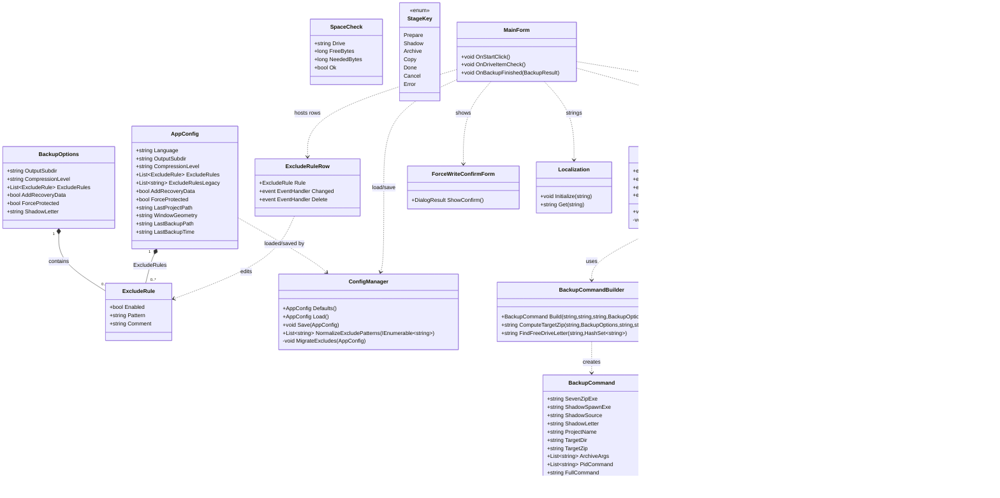
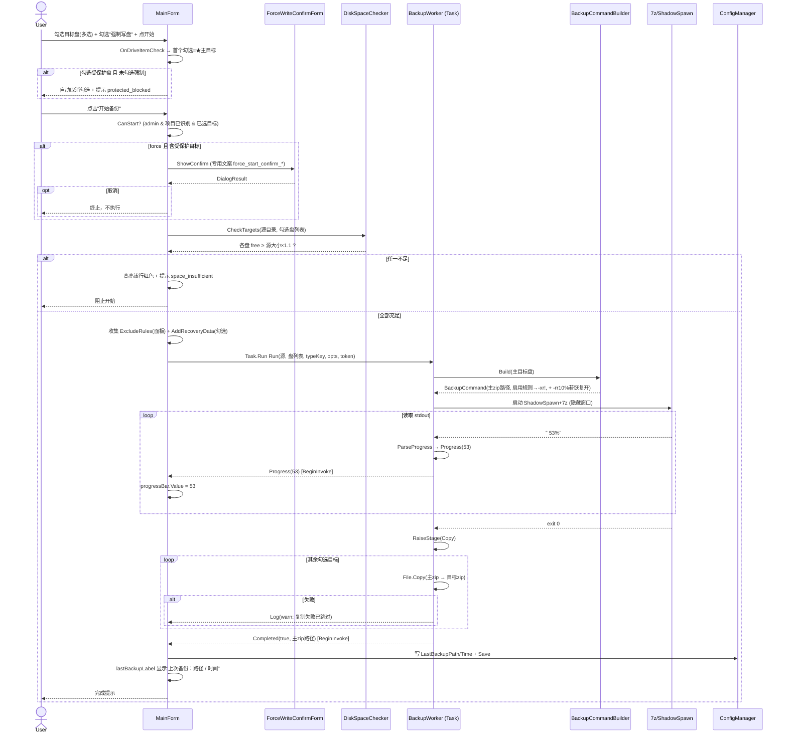
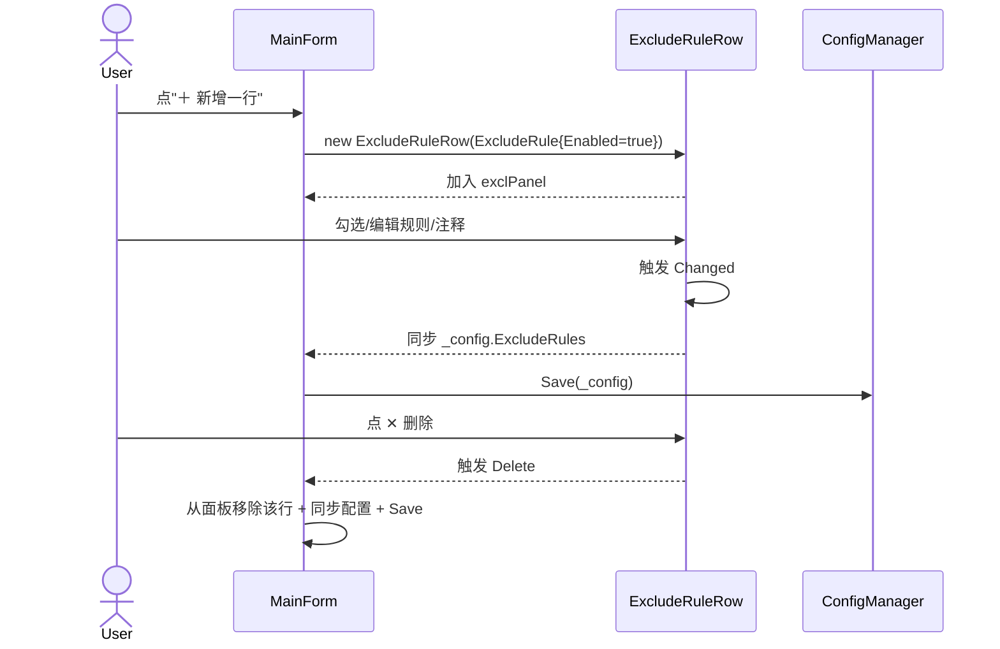
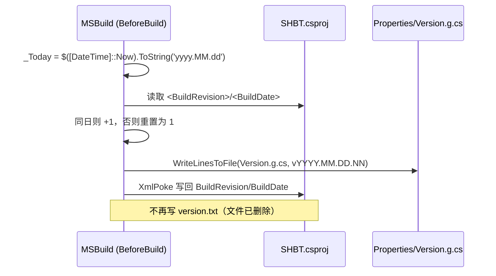
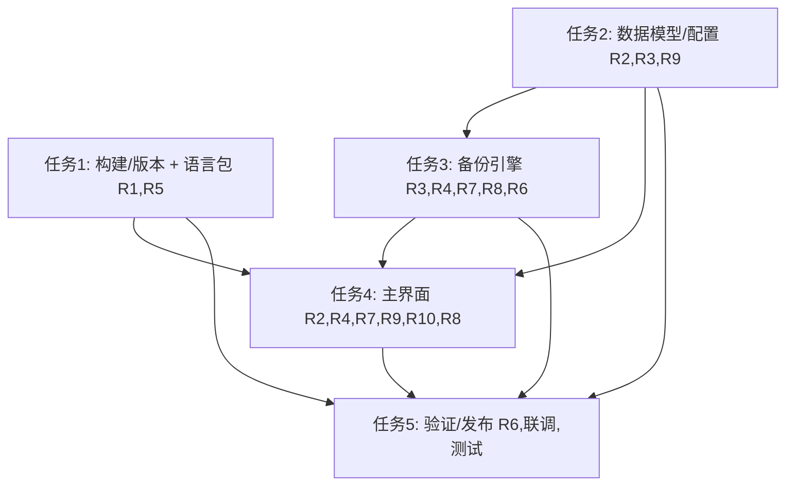

# SHBT 备份工具「增强版」系统架构设计设计 + 任务分解

> 作者：架构师 高见远（Bob）　|　输入：PRD R1–R10 + 主理人已拍板决策 Q1–Q10
> 项目根：`E:\WorkBuddy\SHBT\SHBT\`（.NET Framework 4.8 WinForms，用 .NET 10 SDK 编译，单文件 exe 发布）
> 说明：本设计已对照现有代码（`SHBT.csproj`、`Core/*`、`Ui/*`、`lang/*`、`tests/*`）校准，尽量复用既有机制，仅在必要处增量修改。

---

## Part A：系统设计

### 1. 实现方案（Implementation Approach）

**技术栈保持不变**：WinForms / .NET Framework 4.8 / .NET 10 SDK 编译 / 单文件 exe。**无新增 NuGet 依赖**（序列化继续用 BCL 的 `DataContractJsonSerializer`，进度解析复用既有字节流读取，跨线程封送沿用 `Control.BeginInvoke`）。

**核心难点与对策**

| 难点 | 方案 |
|------|------|
| **R5 版本号源替换**（删除 `version.txt`） | 版本序号 `NN` 改由 csproj 内嵌 `<BuildRevision>` + `<BuildDate>` 承载；`BumpVersion` 目标用 **`<XmlPoke>`** 安全回写（XML 节点编辑，非字符串替换，避免破坏工程文件）；日期取自 `$([System.DateTime]::Now.ToString('yyyy.MM.DD'))`。低风险备选：改放到独立 `version.props` 再 XmlPoke 该文件。 |
| **R4 多目标盘** | `BackupWorker.Run` 入参由单盘 `drive` 改为有序 `List<string> drives`；首个勾选 = ★ 主目标，主目标生成 7z 后 `File.Copy` 到其余目标；复制失败记 **warn 日志、不阻断、不重试**；主目标成功即整体成功。 |
| **R2 可视化排除规则** | 新增值类型 `ExcludeRule{Enabled, Pattern, Comment}`；`AppConfig.ExcludeRules` 由 `List<string>` 升级为 `List<ExcludeRule>`；旧 `string[]` 配置通过**双字段兼容**（新键 `exclude_rules_v2` + 旧键 `exclude_rules` 字符串数组）自动迁移，无需自定义 JSON 解析器。 |
| **R3 恢复数据** | `BackupOptions.AddRecoveryData`（默认 **false**）。**注意**：恢复记录（7z `-rr`）当前未实现——部署的 7-Zip 19.00 命令行不支持 `-rr` 开关，且本工具输出 `.zip` 格式（恢复记录为 7z 专有），故 `BackupCommandBuilder` 不追加任何 `-rr*`，UI 的"恢复数据"复选框已禁用并标注"当前版本不支持"。待升级 7-Zip 到支持 `-rr` 的版本并改用 7z 格式后可重新启用。 |
| **R7 真实进度** | 引擎已能解析 7z stdout 的 `%` 行（`ParseProgress` + `-bsp1`）；只需在 UI 增加 `ProgressBar` 并接入既有 `Progress` 事件（已 `BeginInvoke` 封送）。 |
| **R8 空间预检** | 新增 `Core/DiskSpaceChecker`：递归 `Directory.GetFiles` 估算源大小；逐目标校验 `DriveInfoEx.FreeBytes ≥ 源大小 × 1.1`；不足则高亮该行红色并阻止开始。 |
| **R1 扩语言** | 仅新增 10 个 `lang/*.json`（键集合取自现有文件，值为机器翻译）；`Localization.Initialize` 扫描机制天然支持，无需改发现逻辑。 |
| **R6 日志不落盘** | 代码核查确认：全仓无写盘日志（`BackupWorker` 仅 `RaiseLog` 事件 → `RichTextBox` 内存；`ConfigManager` 仅持久化 `config.json`，非日志）。无需改动，仅做确认性说明。 |

**架构模式**：维持既有「Core（无 WinForms 依赖、可单测）+ Ui（WinForms 表现层）」分层；新增 `DiskSpaceChecker` 归入 Core 以保持可测试性。

---

### 2. 文件列表（相对路径，含新增/修改）

**新增文件**
- `Core/ExcludeRule.cs` —— 排除规则值类型（R2）
- `Core/DiskSpaceChecker.cs` —— 源大小估算 + 逐目标空间预检（R8）
- `Ui/ExcludeRuleRow.cs` —— 单行可视化排除规则控件（R2 UI）
- `Ui/ForceWriteConfirmForm.cs` —— R10 专用二次确认对话框（不复用旧提示）
- `lang/de-DE.json`、`lang/ja-JP.json`、`lang/ko-KR.json`、`lang/pt-BR.json`、`lang/pt-PT.json`、`lang/fr-FR.json`、`lang/it-IT.json`、`lang/es-ES.json`、`lang/be-BY.json`、`lang/id-ID.json` —— 10 种机器翻译语言包（R1）

**修改文件**
- `SHBT.csproj` —— 重写 `BumpVersion` 目标（XmlPoke 回写 `<BuildRevision>/<BuildDate>`，移除 `version.txt` 读写），新增内嵌版本属性（R5）
- `version.txt` —— **删除**（R5）
- `Core/BackupOptions.cs` —— `ExcludeRules` 改为 `List<ExcludeRule>`；新增 `AddRecoveryData`（R2/R3）
- `Core/ConfigManager.cs`（含 `AppConfig`）—— `ExcludeRules` 升级 + 旧配置迁移（R2）；新增 `AddRecoveryData` 默认 true（R3）；新增 `LastBackupPath`/`LastBackupTime`（R9）
- `Core/BackupCommandBuilder.cs` —— 仅取启用规则进 `-xr!`（R2）；追加 `-rr10%`（R3）；新增 `ComputeTargetZip(drive,…)` 供多目标复制（R4）
- `Core/BackupWorker.cs` —— `Run(List<string> drives,…)`：主目标归档 + 复制其余目标（R4）；新增 `Copy` 阶段与复制 warn（R4）；进度解析已具备（R7）；确认无写盘日志（R6）
- `Core/StageKey.cs` —— 枚举新增 `Copy`（R4）
- `Ui/MainForm.Designer.cs` —— `driveListView.CheckBoxes=true`（R4）；移除 `exclTextBox` 改排除规则面板（R2）；新增 `progressBar`（R7）；新增 `lastBackupLabel`（R9）
- `Ui/MainForm.cs` —— 多选目标与 ★ 主目标逻辑（R4）；排除规则面板绑定（R2）；进度条接入（R7）；最近备份展示（R9）；开始前的 R10 专用二次确认与 R8 空间高亮联动；`OnBackupFinished` 写 `LastBackup*`（R9）
- `Ui/Localization.cs` —— 在 `EmbeddedEnUs` 补充新增 UI 键（稳健性兜底，可选但建议）（R1/R2/R3/R4/R8/R9/R10）
- `tests/Tests.cs` —— 扩展 MSTest：排除规则迁移、恢复数据、多目标、空间预检（R2/R3/R4/R8）
- `tests/Smoke/Program.cs` —— 扩展语言发现断言（14 种）+ 新引擎校验（R1/R2/R3/R4）
- `CHANGELOG.md` —— 发布说明（R5 版本机制、新语言、新功能）
- `docs/ARCHITECTURE.md` —— 更新以反映增强设计（引用 enhanced-*.mermaid）

> 注：既有 `docs/class-diagram.mermaid`、`docs/sequence-diagram.mermaid` 为**当前架构基线**，本交付的增强设计图另存为 `docs/enhanced-class-diagram.mermaid` / `docs/enhanced-sequence-diagram.mermaid`，避免覆盖基线；工程师后续可决定是否合并。

---

### 3. 数据结构与接口（类图，Mermaid `classDiagram`）



**关键接口语义**
- `BackupCommandBuilder.Build(projectPath, mainDrive, typeKey, opts)`：为主目标构建命令；仅 `ExcludeRules` 中 `Enabled && !string.IsNullOrWhiteSpace(Pattern)` 的项参与 `-xr!`；`opts.AddRecoveryData` 为真时追加 `-rr10%`。
- `BackupCommandBuilder.ComputeTargetZip(drive, opts, projectPath, typeKey)`：返回任意目标盘的 zip 完整路径（供复制阶段使用，命名规则与主目标一致）。
- `BackupWorker.Run(projectPath, drives, typeKey, opts, token)`：`drives[0]` 为主目标；主目标 7z 成功后逐个 `File.Copy` 到其余目标，失败记 warn。
- `DiskSpaceChecker.CheckTargets(source, drives)`：返回每盘 `SpaceCheck{Ok = FreeBytes ≥ EstimateSourceSize(source)×1.1}`。

---

### 4. 程序调用流程（时序图，Mermaid `sequenceDiagram`）

#### 4.1 主备份流程（R4/R3/R2/R7/R8/R10/R9）



#### 4.2 排除规则编辑流程（R2）



#### 4.3 版本号构建流程（R5）



---

### 5. 待明确事项（Anything UNCLEAR）

1. **版本回写安全性（R5）**：`BeforeBuild` 中用 `<XmlPoke>` 改写 `SHBT.csproj` 自身——MSBuild 评估阶段已完成，通常安全；但为绝对稳妥，备选方案是把 `<BuildRevision>/<BuildDate>` 放到独立 `version.props` 再 XmlPoke 该文件（不影响主 csproj）。实现时二选一，**推荐 `version.props` 以降风险**（PM 决策为优先 csproj 内嵌，两者皆可接受）。
2. **源大小估算阻塞（R8）**：海量小文件项目递归求和可能耗时 1–数秒；当前设计放在 UI 线程 `Start` 时同步计算。若体验不佳可改后台 Task 并显示"校验中…"，需确认是否接受同步阻塞。
3. **最近备份展示文案（R9）**：建议 `上次备份：{path} / {time}`，time 用本地 `yyyy-MM-dd HH:mm:ss`；如 PM 想要其它格式请确认。
4. **机器翻译语言包（R1）**：10 个 JSON 由 MT 生成、无术语表，首版直接提交；建议在 PR/CHANGELOG 标注"机器翻译待人工校对"。
5. **`-rr10%` 位置**：置于 `-mx` 之后、`-xr!` 排除规则之前（与现有 `archiveArgs` 顺序一致），已确认。
6. **复制阶段进度反馈（R4）**：决定复制阶段仅以日志（`stage_copy` + 每盘成功/失败）反馈，进度条只反映 7z 压缩百分比；如需复制进度可后续追加。
7. **两道受保护盘提示并存（R8/R10 交互）**：勾选受保护盘时若未勾强制，仍即时拦截（复用 `protected_blocked`）；R10 的**专用**二次确认仅在「点开始备份」且「已勾强制且含受保护目标」时弹出。两道提示共存合理，已确认。

---

## Part B：任务分解（Task Decomposition）

### 6. 依赖包列表（Required Packages）

**无新增 NuGet 依赖。** 维持现状：
- `Microsoft.NETFramework.ReferenceAssemblies@1.0.3`（既存，供 .NET 10 SDK 编译 net48）
- 测试：`MSTest.TestFramework` / `MSTest.TestAdapter`（既存 `tests/Tests.csproj`）
- 序列化：`System.Runtime.Serialization.Json`（BCL，net48 自带，`DataContractJsonSerializer`）
- 单文件发布：csproj 既存 `PublishSingleFile` / 单文件 exe 配置

```
- Microsoft.NETFramework.ReferenceAssemblies@^1.0.3 : 编译期仅引用 net48 程序集（既存）
- MSTest.TestFramework / MSTest.TestAdapter : 单元测试（既存，tests/Tests.csproj）
# 无需任何新增第三方包
```

---

### 7. 任务列表（有序、含依赖、按实现顺序排列）

> 规则：≤5 个任务、每任务 ≥3 文件、首任务为基础设施、按依赖排序、标注 P0/P1/P2 与 R 编号/涉及文件/可并行性。

#### T01 — 构建与版本重构 + 语言包扩充　【P0】【R5, R1】
- **依赖**：无（可独立，与 T02 并行）
- **涉及文件**：`SHBT.csproj`、`version.txt`（删除）、`lang/de-DE.json … lang/id-ID.json`（10 新增）、`lang/zh-CN.json / zh-TW.json / en-US.json / ru-RU.json`（补新键）、`Ui/Localization.cs`（EmbeddedEnUs 补键）、`CHANGELOG.md`（初稿）
- **要点**：csproj 内嵌 `<BuildRevision>/<BuildDate>`；`BumpVersion` 用 `<XmlPoke>` 安全回写并生成 `Version.g.cs`；移除 `version.txt` 读写与 `<None Include="version.txt">`；新增 10 个语言 JSON（键取自现有文件、值机器翻译）；4 个现有语言文件补充新增 UI 键（`exclude_add_row`、`recovery_data`、`last_backup`、`stage_copy`、`copy_ok`、`copy_warn`、`space_insufficient`、`force_start_confirm_title`、`force_start_confirm_msg`、`target_multi_hint` 等）。
- **可并行**：✔ 与 T02 并行

#### T02 — 数据模型与配置序列化　【P0】【R2, R3, R9】
- **依赖**：无（逻辑上先于 T03/T04）
- **涉及文件**：`Core/ExcludeRule.cs`（新增）、`Core/BackupOptions.cs`、`Core/ConfigManager.cs`
- **要点**：新增 `ExcludeRule{Enabled,Pattern,Comment}`；`BackupOptions.ExcludeRules` 改为 `List<ExcludeRule>` 并加 `AddRecoveryData`（默认 true）；`AppConfig.ExcludeRules` 升级为 `List<ExcludeRule>`（新键 `exclude_rules_v2`）+ 兼容旧 `string[]` 的 `ExcludeRulesLegacy`（键 `exclude_rules`）；`ConfigManager.Load` 做迁移（旧字符串数组 → `ExcludeRule{Enabled=true}`），`Save` 时置 `ExcludeRulesLegacy=null` 仅写 V2；新增 `LastBackupPath`/`LastBackupTime`；默认 `AddRecoveryData=true`。
- **可并行**：✔ 与 T01 并行

#### T03 — 备份引擎改造　【P0】【R3, R4, R7(引擎侧), R8(核心), R6】
- **依赖**：T02
- **涉及文件**：`Core/BackupCommandBuilder.cs`、`Core/BackupWorker.cs`、`Core/DiskSpaceChecker.cs`（新增）、`Core/StageKey.cs`
- **要点**：`BackupCommandBuilder` 仅取启用规则进 `-xr!`、追加 `-rr10%`、新增 `ComputeTargetZip`；`BackupWorker.Run(List<string> drives,…)` 主目标归档 + `File.Copy` 复制其余目标（失败记 warn、不阻断不重试）、新增 `Copy` 阶段；进度解析沿用既有 `ParseProgress`（R7 引擎侧已具备）；`DiskSpaceChecker` 提供 `EstimateSourceSize` + `CheckTargets`；确认无写盘日志（R6）。
- **可并行**：✘（依赖 T02）

#### T04 — 主界面改造　【P1】【R2(UI), R4(UI), R7(UI), R9(UI), R10, R8(高亮联动)】
- **依赖**：T01（语言键）、T02（模型）、T03（引擎签名）
- **涉及文件**：`Ui/MainForm.Designer.cs`、`Ui/MainForm.cs`、`Ui/ExcludeRuleRow.cs`（新增）、`Ui/ForceWriteConfirmForm.cs`（新增）
- **要点**：`driveListView.CheckBoxes=true` 多选 + 首个勾选标 ★ 主目标（R4）；移除 `exclTextBox`、改 `exclPanel` + `ExcludeRuleRow`（R2）；新增 `progressBar` 接入 `Progress`（R7）；新增 `lastBackupLabel` 只读展示（R9）；`OnStartClick` 中 force+含受保护目标时弹 `ForceWriteConfirmForm` 专用确认（R10）；`StartBackup` 前 `DiskSpaceChecker.CheckTargets` 不足则高亮红行阻止（R8）；`OnBackupFinished` 写 `LastBackup*`（R9）。
- **可并行**：✘（依赖 T01/T02/T03）

#### T05 — 验证与发布　【P2】【R6 确认, 联调, 测试扩展, 文档】
- **依赖**：T01, T02, T03, T04
- **涉及文件**：`tests/Tests.cs`、`tests/Smoke/Program.cs`、`CHANGELOG.md`（定稿）、`docs/ARCHITECTURE.md`
- **要点**：`Tests.cs` 扩展（排除迁移、恢复数据、多目标、空间预检）；`Smoke/Program.cs` 扩展 14 语言发现断言 + 新引擎校验；`CHANGELOG.md` 定稿发布说明；`docs/ARCHITECTURE.md` 更新引用增强设计；最终确认全仓无写盘日志（R6）。
- **可并行**：✘（收尾，依赖全部）

**实现顺序建议**：`T01 ‖ T02` → `T03` → `T04` → `T05`。

---

### 8. 共享知识（Shared Knowledge / 跨文件约定）

- **JSON 配置键**：`config.json` 全小写下划线（`exclude_rules_v2`、`add_recovery_data`、`last_backup_path`、`last_backup_time` 等）；语言文件键同风格。
- **排除规则**：仅 `Enabled==true` 且 `Pattern` 非空的项进入 7z `-xr!`；`Comment` 永不进入命令。
- **多目标语义**：主目标 = 勾选列表首个；其余目标由 `File.Copy` 复制主 zip；复制失败记 **warn**、不阻断、不重试；主目标成功 = 整体成功。
- **恢复数据**：当前未实现（见 R3 表格说明）：7-Zip 19.00 不支持 `-rr` 且 `.zip` 格式不支持恢复记录，故命令不含 `-rr*`，`AddRecoveryData` 默认关，UI 复选框禁用。
- **版本格式**：`vYYYY.MM.DD.NN`，`NN` 来自 `<BuildRevision>`（同日 +1，跨日重置 1），日期取自构建时 `$([System.DateTime]::Now)`；`Properties/Version.g.cs` 由构建目标生成、`AppVersion.Display` 供 UI 展示。
- **线程模型**：`BackupWorker` 在 `Task` 线程运行；所有 UI 更新必须经 `Control.BeginInvoke/Invoke` 封送（net48 WinForms 跨线程）。`Progress`/`StageChanged`/`Log`/`Completed` 事件已在 `MainForm` 侧 `BeginInvoke` 订阅。
- **日志**：仅 `RichTextBox` 内存展示，原生 `Ctrl+C` 可复制，**不加复制按钮**；全仓不写日志文件（`config.json` 持久化不视为日志）。
- **分层约定**：`Core/*` 不依赖 WinForms（保持可单测/可在 Smoke 的 net10 下运行）；`Ui/*` 依赖 WinForms。
- **本地化键值**：阶段键 `stage_*` 与 `StageKey` 枚举小写名一一对应；类型键 `type_*`；新增 UI 键须同时出现在 14 个语言文件与 `EmbeddedEnUs` 兜底。
- **字符编码**：7z/stdout 解码 UTF-8 → 失败回退系统默认代码页（既有 `DecodeLine`）。

---

### 9. 任务依赖图（Task Dependency Graph，Mermaid `graph`）


